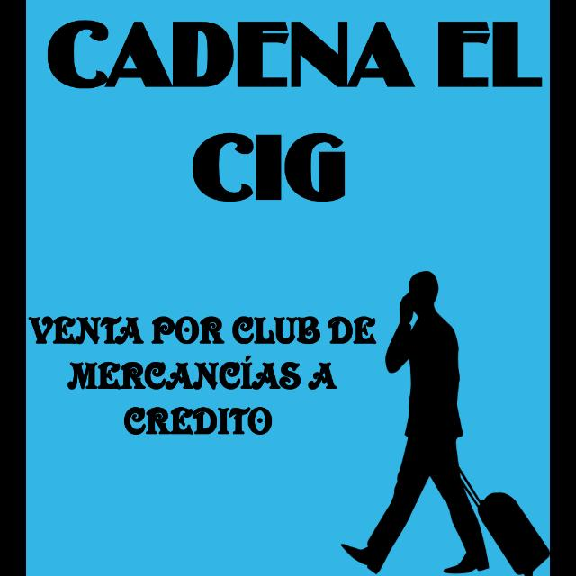
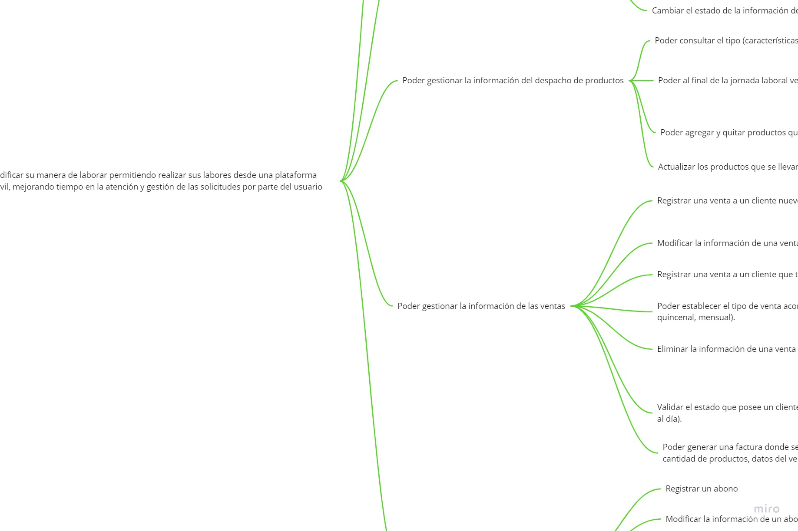
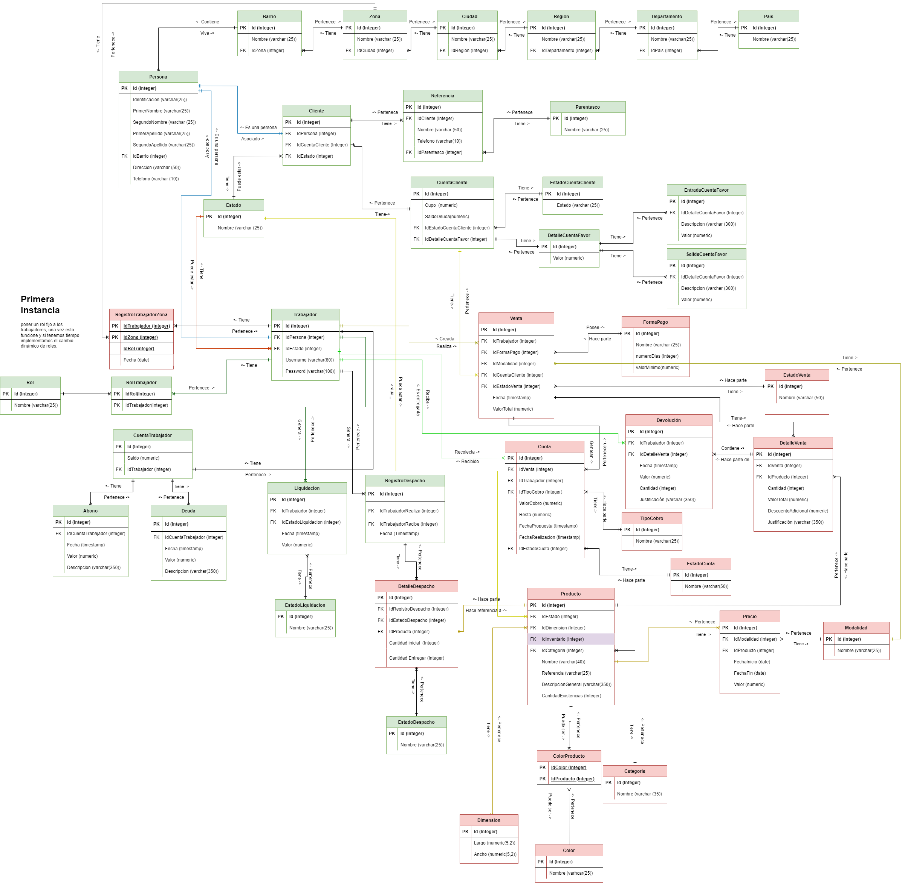
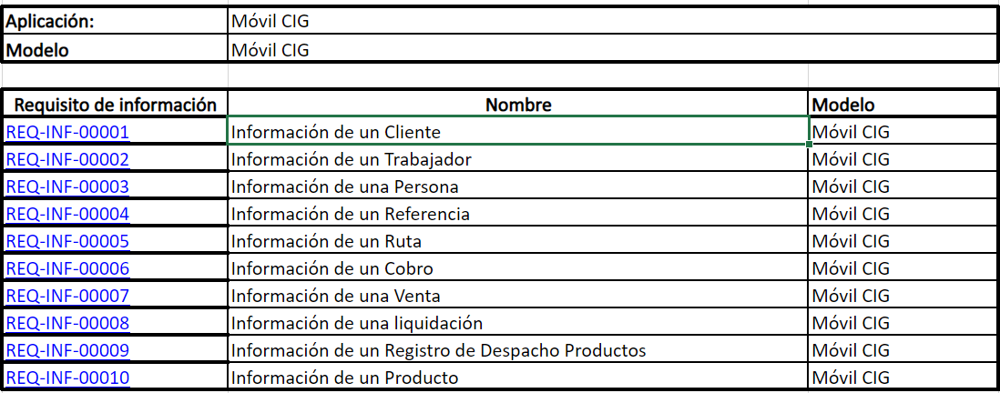
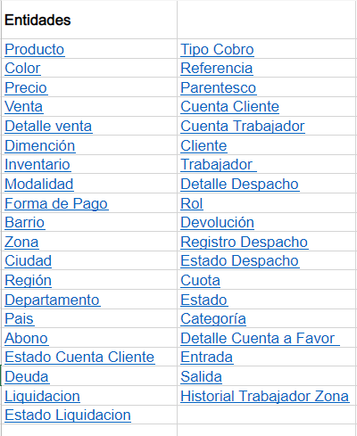
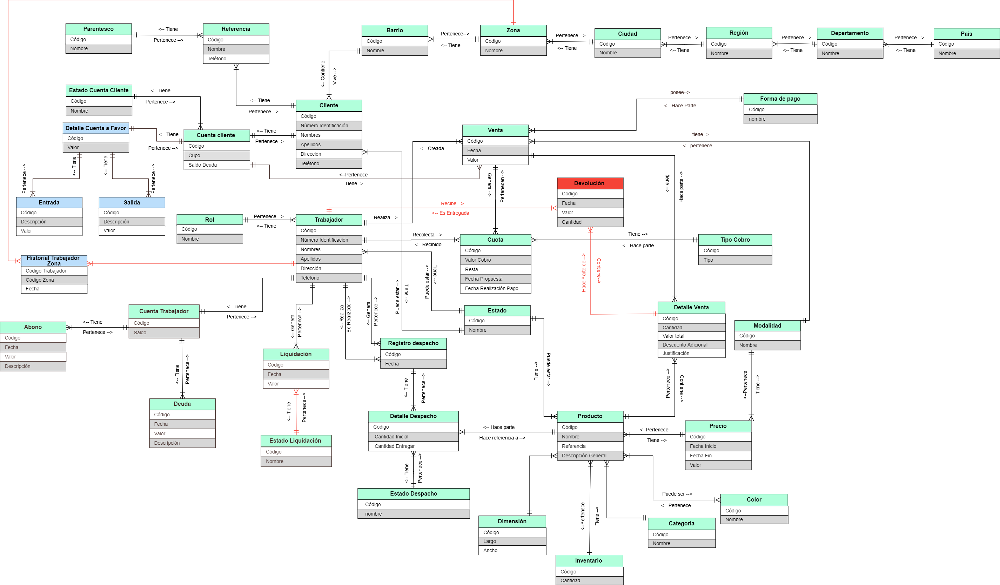
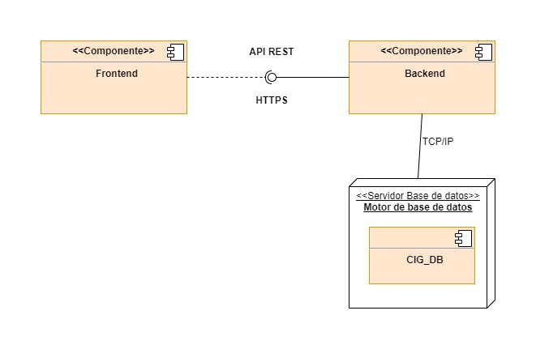
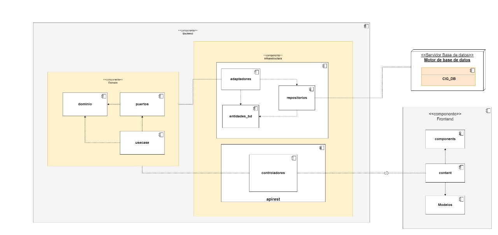
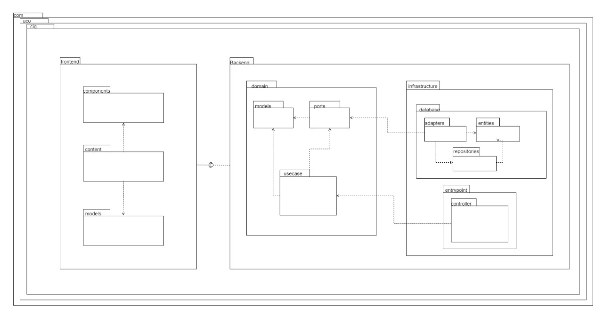
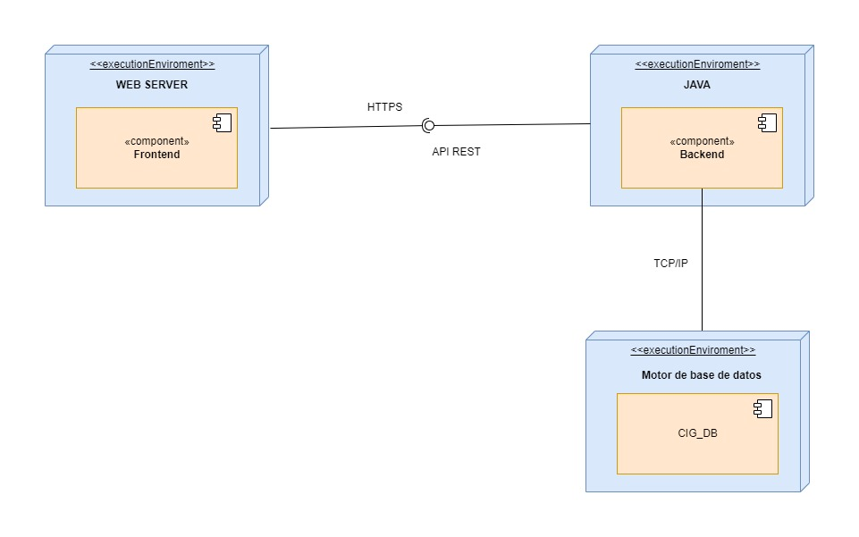

        

<h1 align="center">
    <b>Almacen Cadena El CIG</b>
     
    
</h1>

 

## Visión del proyecto Almacen Cadena el CIG
</h3></a>

Móvil CIG, es una aplicación móvil desarrollada a la medida para el almacén cadena el CIG, que tiene por objetivo mejorar la atención al usuario, facilitando los procesos de cobro, registro, búsqueda, almacenamiento de información y la ejecución de tareas que hoy se realizan de manera manual, incluyendo la gestión del desempeño de los trabajadores como el control y seguimiento de los productos del almacen. 
    
A diferencia de otras aplicaciones (Disapp, Handy, Persat, Cobranza móvil), que buscan soportar tareas similares, Movil CIG es una aplicación centrada 100% al segmento de negocio y donde los empleados realizan tareas de manera desconectada.

--- 
## Justificación

El almacén cadena el CIG desde hace algunos años viene buscando una alternativa a sus métodos tradicionales de manejar y gestionar la información, esta se gestiona de manera manual mediante cuadernos y tarjetas. Es debido a esta necesidad que nace la idea de una plataforma de software para solucionar la problemática.  Por otra parte, la tecnología es útil para generar soluciones dentro del ámbito de la ingeniería de sistemas que impacten positivamente la sociedad y mejoren la calidad de vida, la tecnología es una herramienta que logra facilitar la solución de muchos procedimientos de gran complejidad y genera soluciones confiables, esta herramienta es un pilar clave ya evidente en el progreso y avance de la vida humana, optimiza recursos, y tiempo, y genera múltiples formas de comunicación. Esto conlleva a una ideología de trabajo en equipo estructura clave para la productividad, y desarrollo sano de cualquier tipo de entidad ya sea fábricas, almacenes, etc. La plataforma de software pretende convertirse en la solución ideal para el almacén ya que evitará muchos inconvenientes a la hora de almacenar y consultar la información que manejan, esta se encontrara al alcance de un clic y no tendrán que buscar entre montones de tarjetas. El desarrollo de la plataforma también le permitirá al almacén bajar costos en gastos de papelería como cuadernos, tarjetas, lapiceros etc. Esto también se traducirá en un impacto ambiental importante mediante el ahorro de papel y plástico. 
También indagamos con el almacén en la parte de hurtos y es algo que se puede presentar con frecuencia ya que es casi imposible para los vendedores saber el tipo de cliente con el que están tratando, gracias a la plataforma de software se tendrá registro al historial crediticio de cada cliente que tiene el almacén y por consiguiente los trabajadores podrán conocer su cumplimiento, de esta manera podrán realizar sus labores con más confianza y exponiendo al almacén a menos perdidas, estas son generadas cuando un cliente reincide en un crédito nuevo cuando este ya presenta uno antiguo y se encuentra en mora o en las bases de datos de créditos morosos del almacén.
Por último y no menos importante esperamos impactar la calidad de vida de todo el personal del almacén ya que el dueño tendrá menos preocupaciones y un control mayor sobre su negocio lo que se traduciría en menos carga de estrés y trabajo. Los trabajadores del almacén podrán llevar a cabo sus labores con más facilidad y que disminuirá el porcentaje de error lo que le evitará problemas con el almacén y contribuirán a un mejor desempeño laboral y por ende mejores ingresos para él.

--- 
## Objetivo general

Reducir los tiempos que utilizan los empleados del almacén para realizar las tareas en sus rutas diarias (registrar clientes, acceder a sus datos, registrar un pago o una nueva venta).

## Objetivos específicos 
* Identificar las reglas de negocio que se manejan en el almacén cadena el CIG.
* Determinar el tiempo que tardan los vendedores al realizar las tareas en las rutas diarias.
*  Desarrollar una aplicación móvil que permita disminuir el tiempo empleado en las labores de los trabajadores.
*  Indicar el funcionamiento de la aplicación móvil a los empleados del almacén para el correcto uso.
---

## Marco teórico

En la actualidad las ventas a crédito son el único método que tienen muchas familias colombianas para acceder a bienes materiales, esto se convierte en una gran oportunidad para los negocios de ganar más clientes, pero esto trae consigo retos sobre todo en el campo de la seguridad.
Para superar estas dificultades a lo largo de los años el almacén cadena el CIG ha estado cambiando la forma de otorgar los créditos, de tal manera que sea más cómodo para sus clientes y más seguro para el negocio. En la actualidad el sistema de créditos se maneja de la siguiente manera:
Para ventas nuevas:
1. El vendedor visita al cliente. 
2.	Le ofrece los productos en existencia.
3.	Acuerda con ellos las formas de pago y precio de los productos.
4.	Cuando el cliente acepta, proceden a llenar los datos para el crédito en la tarjeta física, los cuales son: nombre completo, numero de cedula, dirección de residencia, dos teléfonos familiares y por último firmar la parte de atrás de la tarjeta aceptando el crédito.
Recargos: el vendedor visita al cliente, le ofrece los productos en existencia, pactan con ellos el precio y la forma en que debe seguir cancelando sus cuotas, ya que cuentan con un crédito previamente activo, una vez ellos llegan al almacén informan al personal administrativo para hacer el registro del recargo en la tarjeta física.

Por otra parte, se encuentra el manejo de los productos del almacén, para llevar el control sobre ellos disponen de lo siguiente:
Inventario: No se cuenta con un inventario en el almacén.
Despachar productos: se realiza el registro sobre los productos que lleva cada trabajador anotando en un cuaderno que se tiene para cada uno de ellos y así controlar lo que sale y entra del almacén.

Otra de las cosas importantes para almacén cadena el CIG son sus rutas, estas les permiten saber el número de clientes en un municipio o zona determinada, además de orientar al trabajador para realizar de manera más optima su trabajo. Se manejan de la siguiente manera:
Rutas: Las rutas están definidas primero por municipio, luego por zonas, estas ya presentan una ruta lógica definida por el almacén en la cual solo se pueden hacer modificación por casos como cambio de residencia o adaptar u agregar cliente nuevo a la misma.

Cabe recalcar que todas las actividades anteriormente nombradas son llevadas a cabo de manera manual, es por esto que el almacén se ha visto abocado a buscar soluciones tecnológicas para motivar el crecimiento de su negocio y brindar una mejor calidad de vida a sus trabajadores, además de una mejor atención a sus clientes. Debido a que el almacén no centra sus operaciones en un solo lugar, debido a que sus ventas y cobros son realizados de manera ambulante, se busca la manera de que la solución fuera completa y abarcara las dos facetas del negocio por esto se requiere una aplicación de escritorio y una móvil.

---
 
 

## Impacto social
El desarrollo del proyecto genera un gran impacto a nivel social, debido a que se espera mejorar la calidad del servicio que van a recibir los clientes de almacén cadena el CIG, además de hacer más óptima la labor de sus empleados

---
## User history mapping 
Las historias de usuario son descripciones cortas y simples de una característica contada desde la perspectiva de la persona que desea la nueva capacidad, generalmente un usuario o cliente del sistema.

El impact mapping es la metodología que propone concentrar esfuerzos en lo realmente importante, en hacer las preguntas correctas para lograr determinar con precisión qué es aquello que debe conseguirse para lograr las metas deseadas.

[Documentación](https://uconet.sharepoint.com/:w:/r/sites/ProyectoMvilCIG/_layouts/15/Doc.aspx?sourcedoc=%7B867900CE-B995-4552-B631-C17D30725131%7D&file=Impact%20mapping.docx&action=default&mobileredirect=true)

---
## Modelo Entidad Relación - MER
> Es un tipo de diagrama de flujo que ilustra cómo las "entidades", como personas, objetos o conceptos, se relacionan entre sí dentro de un sistema. Los diagramas ER se usan a menudo para diseñar o depurar bases de datos relacionales en los campos de ingeniería de software, sistemas de información empresarial, educación e investigación.

---

## Requisitos de información modelo Seguridad

---
## Restricciones de negocio
> Barreras de entrada al mercado (legales o acuerdos contractuales, logísticas, de poder de mercado; etc.) Costos ocultos del proceso (inexperiencia en el rubro, gastos no concurrentes, ineficiencia del personal, daños y pérdidas de fuerza mayor o desastres naturales; etc.)

[Documentación](https://uconet.sharepoint.com/:w:/r/sites/ProyectoMvilCIG/_layouts/15/Doc.aspx?sourcedoc=%7B9BA39620-1C61-4BFD-BB7B-E566BC2E409D%7D&file=Restricciones.docx&action=default&mobileredirect=true)

---

## Simulación de Datos
> La simulación es una herramienta muy potente para la evaluación y el análisis de los sistemas nuevos y los ya existentes. Permite anticiparse al proceso real, validarlo y obtener su mejor configuración.

--- 

## Modelo de dominio
> Es un modelo conceptual de todos los temas relacionados con un problema específico. En él se describen las distintas entidades, sus atributos, papeles y relaciones, además de las restricciones que rigen el dominio del problema.

---

## Modelo Arquitectónico

 Conjunto de decisiones de diseño arquitectural
que son aplicables en un contexto de desarrollo específico, restringen las decisiones de diseño de un sistema a ese contexto y plantean como objetivo ciertas cualidades para el sistema resultante.

--- 

## Arquitectura de referencia

 Plantilla de solución para una arquitectura de un dominio particular. 

---

## Diagrama de paquetes

 Son diagramas estructurales que se emplean para mostrar la organización y disposición de diversos elementos de un modelo en forma de paquetes. Un paquete es una agrupación de elementos UML relacionados, como diagramas, documentos, clases o, incluso, otros paquetes. 

---

## Diagrama de despliegue

 Es un tipo de diagrama UML que muestra la arquitectura de ejecución de un sistema, incluyendo nodos como entornos de ejecución de hardware o software, y el middleware que los conecta. 

## Notas de lo que se tenia hasta la fecha de reunion de entrega y lo que se tiene hasta su entrega 4 dias despues 

Hasta el 08/09/2022

Frontend:

1. Diseño de las pantallas establecidas.
2. Navegación entre las pantallas operativas.
3. Conectividad con el backend (solo pantalla crear cliente)

Hasta el 12/09/2022

Frontend:
1. modificación diseño pantalla crear ruta.
2. limpieza en código y empalme con backend de pantallas:
crear cliente.
crear empleado.
crear ruta.
realizar venta.
visualizar clientes.
visualizar empleados
implementacion del auth0 y configuración de roles.

Backend:

Hasta el 08-sep-2022

1. Se tenía definida arquitectura hexagonal con la siguiente estructura

-	Se tenía definido el dominio con los puestos expuestos de los repositorios
-	Ya estaba definidas todas las entidades de la base de datos
-	Se tenían los adaptadores para los repositorios expuestos en el dominio
-	Se tienen construidos los casos de uso para administrar 
-	Clientes
-	Empleados
-	Ventas
-	Cobros
-	Productos
-	Estaban creados los controladores rest
-	Despliegue en Heroku

Después del el 08-sep-2022

-	Se crearon pruebas unitarias para los casos de uso (no se alcanzó a cubrir el 100%)
-	Se implementó Auth0 para la autorización del api
-	Se crearon casos de uso para la administración de Rutas
-	Se despliega en Heroku con los nuevos cambios

